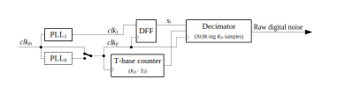
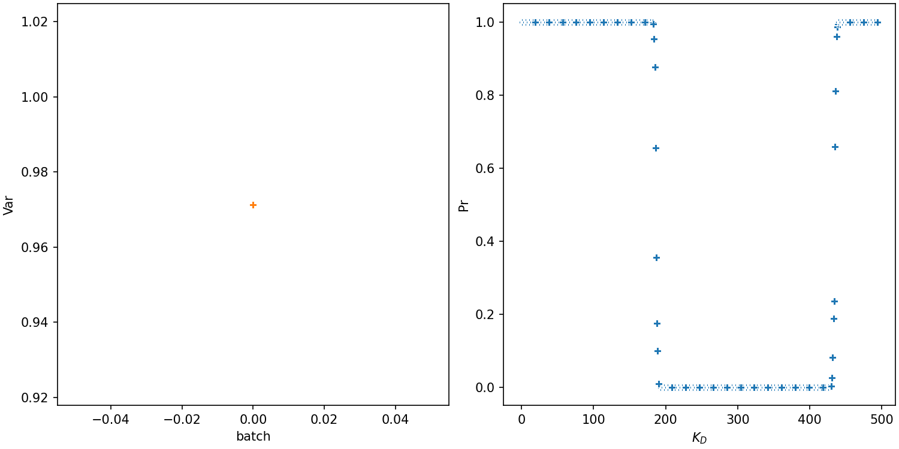

[](https://www.gnu.org/licenses/gpl-3.0)
[](https://www.python.org/)
[](https://colab.research.google.com/)
[](https://mlflow.org/)
[](https://github.com/psf/black)
[](https://mybinder.org/v2/gh/maciejskorski/enhanced-pll-trng/main)

# Enhancing Quality and Security of the PLL-TRNG

## Authors

<p align="center">
    <a href="mailto:nathalie.bochard@univ-st-etienne.fr"><strong>Nathalie Bochard</strong></a>
    <a href="mailto:florent.bernard@univ-st-etienne.fr"><strong>Florent Bernard</strong></a>
    <a href="mailto:quentin.dallison@thalesgroup.com"><strong>Quentin Dallison</strong></a>
    <a href="mailto:fischer@univ-st-etienne.fr"><strong>Viktor Fisher</strong></a>
    <a href="https://skorski.lu"><strong>Maciej Skórski</strong></a>
</p>

## About

This repository contains supplementary material (data and code) to reproduce the evaluation of a true random number generator presented in "Enhancing Quality and Security of the PLL-TRNG" at TCHES 2023.

<figure>

<figcaption style="text-align:center">Figure: PLL TRNG Architecture</figcaption>
</figure>

## Data

<details>
  <summary>Show more</summary>
  
Data used in experiments are stored under the `data` directory. Sub-directories at the first level group experiments logically according to the environmental conditions (corner values, regular conditions, extreme temperature). Further sub-directories group acquired data by
the FPGA card family (CV- Cyclone®V, S6 - Spartan™6, SF - SmartFusion2®, two Spartan devices were tested), and by configurations described in the paper (A, B, or C with one or two PLL outputs as indicated by the suffix, e.g. A_1 vs A_2). Finally, the data files have extension 
`.dff` and  the associated metadata files have extension `.log`.

```
├───📁 CornerAnalysis/
│   └───📄 corner_values.xlsx
├───📁 ExtremeTemperature/
│   └───📄 S6_C_freezing attack_km476_kd495_dff.bin
├───📁 Regular/
│   ├───📁 CVv12_4/
│   │   ├───📁 A_1/
│   │   │   └───...
│   │   ├───📁 A_2/
│   │   │   └───...
│   │   ├───📁 B_1/
│   │   │   └───...
│   │   ├───📁 B_2/
│   │   │   └───...
│   │   ├───📁 C_1/
│   │   │   └───...
│   │   └───📁 C_2/
│   │       └───...
│   ├───📁 S6v11_2/
│   │   ├───📁 A_1/
│   │   │   └───...
│   │   ├───📁 A_2/
│   │   │   └───...
│   │   ├───📁 B_1/
│   │   │   └───...
│   │   ├───📁 B_2/
│   │   │   └───...
│   │   ├───📁 C_1/
│   │   │   └───...
│   │   └───📁 C_2/
│   │       └───...
│   ├───📁 S6v11_8/
│   │   ├───📁 A_1/
│   │   │   └───...
│   │   ├───📁 A_2/
│   │   │   └───...
│   │   ├───📁 B_1/
│   │   │   └───...
│   │   ├───📁 B_2/
│   │   │   └───...
│   │   ├───📁 C_1/
│   │   │   └───...
│   │   ├───📁 C_2/
│   │   │   └───...
│   │   └───📄 .DS_Store
│   └───📁 SF2v11_11/
│       ├───📁 A_1/
│       │   └───...
│       ├───📁 A_2/
│       │   └───...
│       ├───📁 B_1/
│       │   └───...
│       ├───📁 B_2/
│       │   └───...
│       ├───📁 C_1/
│       │   └───...
│       └───📁 C_2/
│           └───...
└───📄 data.zip
```

</details>

## Code

<details>
  <summary>Show more</summary>

The code can be found under the `src` directory:
* The experiments were executed on Google Colab and can be reproduced with the notebook [src/TRNG_Dependency_Analysis.ipynb](src/TRNG_Dependency_Analysis.ipynb) 
* [src/find_PLL-TRNG_configs_FPGA_2023.py](src/find_PLL-TRNG_configs_FPGA_2023.py) is the Python script that generates the list of all possible configurations, along with the list of time distances between contributing bits. [The main code block](https://github.com/maciejskorski/new_pll_trng/blob/main/src/find_PLL-TRNG_configs_FPGA_2023.py#L523-L549) contains the constraints of the state-space to explore.
* [data/corner/corner_values.xlsx](data/corner/corner_values.xlsx) contains test results for corner values in temperature and supply voltage, that are [analysed in this notebook](src/CornerValues.ipynb). The data directory structure is summarized below:
```
├───📁 CornerAnalysis/
│   └───📄 corner_values.xlsx
├───📁 ExtremeTemperature/
│   └───📄 S6_C_freezing attack_km476_kd495_dff.bin
├───📁 Regular/
│   ├───📁 CVv12_4/
│   │   ├───📁 A_1/
│   │   │   └───...
│   │   ├───📁 A_2/
│   │   │   └───...
│   │   ├───📁 B_1/
│   │   │   └───...
│   │   ├───📁 B_2/
│   │   │   └───...
│   │   ├───📁 C_1/
│   │   │   └───...
│   │   └───📁 C_2/
│   │       └───...
│   ├───📁 S6v11_2/
│   │   ├───📁 A_1/
│   │   │   └───...
│   │   ├───📁 A_2/
│   │   │   └───...
│   │   ├───📁 B_1/
│   │   │   └───...
│   │   ├───📁 B_2/
│   │   │   └───...
│   │   ├───📁 C_1/
│   │   │   └───...
│   │   └───📁 C_2/
│   │       └───...
│   ├───📁 S6v11_8/
│   │   ├───📁 A_1/
│   │   │   └───...
│   │   ├───📁 A_2/
│   │   │   └───...
│   │   ├───📁 B_1/
│   │   │   └───...
│   │   ├───📁 B_2/
│   │   │   └───...
│   │   ├───📁 C_1/
│   │   │   └───...
│   │   ├───📁 C_2/
│   │   │   └───...
│   │   └───📄 .DS_Store
│   └───📁 SF2v11_11/
│       ├───📁 A_1/
│       │   └───...
│       ├───📁 A_2/
│       │   └───...
│       ├───📁 B_1/
│       │   └───...
│       ├───📁 B_2/
│       │   └───...
│       ├───📁 C_1/
│       │   └───...
│       └───📁 C_2/
│           └───...
└───📁 TemperatureAttack/
    └───📄 S6_C_freezing attack_km476_kd495_dff.bin
```
</details>


## Results Overview

### Statistical Analysis under Regular Conditions

TBD

### Analysis under Corner Values

TBD

### Temperature Attack




## Links

- For random number generator standards, see [AIS-31 (New Draft)](https://www.bsi.bund.de/SharedDocs/Downloads/EN/BSI/Certification/Interpretations/AIS_31_Functionality_classes_for_random_number_generators_e.pdf?__blob=publicationFile&v=5)
- For more about stochastic models for PLL-based designs, see ["Modern Random Number Generator Design - Case Study on a Secured PLL-based TRNG"](https://www.degruyter.com/document/doi/10.1515/itit-2018-0025/html?lang=en)
