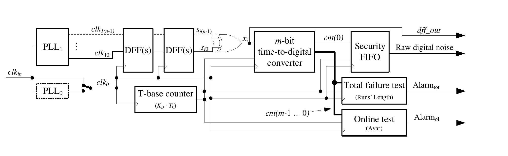

[](https://www.gnu.org/licenses/gpl-3.0)
[](https://www.python.org/)
[](https://www.r-project.org/)
[](https://www.docker.com/)
[](https://mlflow.org/)
[](https://github.com/psf/black)
[](https://colab.research.google.com/)
<a id="binder_link">[](https://mybinder.org/v2/gh/maciejskorski/enhanced-pll-trng/main)</a>

# Enhancing Quality and Security of the PLL-TRNG

## :star: Authors

<p align="center">
    <a href="https://skorski.lu"><strong>Maciej Skórski</strong></a>,
    <a href="mailto:quentin.dallison@thalesgroup.com"><strong>Quentin Dallison</strong></a>,
    <a href="mailto:nathalie.bochard@univ-st-etienne.fr"><strong>Nathalie Bochard</strong></a>,
    <a href="mailto:florent.bernard@univ-st-etienne.fr"><strong>Florent Bernard</strong></a>,
    <a href="mailto:fischer@univ-st-etienne.fr"><strong>Viktor Fisher</strong></a>
</p>

## :memo: About

This repository contains supplementary material (data and code) to reproduce the evaluation of a true random number generator presented in :open_book: "Enhancing Quality and Security of the PLL-TRNG" at TCHES 2023.

<figure>

<figcaption style="text-align:center">Figure: PLL-TRNG Architecture</figcaption>
</figure>

## :file_folder: Data

All necessary data can be found under the `data` directory.
The zipped data are available to download from [releases](https://github.com/maciejskorski/enhanced-pll-trng/releases).

<details>
  <summary>Read more about data structure</summary>
  
Data used in experiments are stored under the `data` directory.
Sub-directories at the first level group experiments according to the environmental conditions (regular conditions, corner values and a temperature attack scenario).
- The file in `data/CornerAnalysis` regroups all results accross all cards, configurations and external conditions;
- The temperature attack was executed on a single Spartan device, and its results are in `data/TemperatureAttack`;
- Further sub-directories in `data/Regular` group acquired data according to the FPGA card family (CV - Cyclone®V, S6 - Spartan™6, SF - SmartFusion2®), in which we find all configurations as described in the paper (A, B, or C with one or two PLL outputs as indicated by the suffix, e.g. A_1 vs A_2).
Note that two Spartan devices were tested, both placed on the cards version 11, cards #2 and #8 marked S6v11_2 and S6v11_8.
For each experiment, the data file contains the bitstream available at the sampler output, i.e. the D flip-flop output marked dff_out in Figure 3. The binary files end in `_dff.bin` and the associated metadata files have extension `.log`.

```
├───📁 CornerAnalysis/
│   └───📄 corner_values.xlsx
├───📁 TemperatureAttack/
│   └───📄 S6_C_freezing attack_km476_kd495_dff.bin
├───📁 Regular/
│   ├───📁 CVv12_4/
│   │   ├───📁 A_1/
│   │   │   └───...
│   │   ├───📁 A_2/
│   │   │   └───...
│   │   ├───📁 B_1/
│   │   │   └───...
│   │   ├───📁 B_2/
│   │   │   └───...
│   │   ├───📁 C_1/
│   │   │   └───...
│   │   └───📁 C_2/
│   │       └───...
│   ├───📁 S6v11_2/
│   │   ├───📁 A_1/
│   │   │   └───...
│   │   ├───📁 A_2/
│   │   │   └───...
│   │   ├───📁 B_1/
│   │   │   └───...
│   │   ├───📁 B_2/
│   │   │   └───...
│   │   ├───📁 C_1/
│   │   │   └───...
│   │   └───📁 C_2/
│   │       └───...
│   ├───📁 S6v11_8/
│   │   ├───📁 A_1/
│   │   │   └───...
│   │   ├───📁 A_2/
│   │   │   └───...
│   │   ├───📁 B_1/
│   │   │   └───...
│   │   ├───📁 B_2/
│   │   │   └───...
│   │   ├───📁 C_1/
│   │   │   └───...
│   │   ├───📁 C_2/
│   │   │   └───...
│   │   └───📄 .DS_Store
│   └───📁 SF2v11_11/
│       ├───📁 A_1/
│       │   └───...
│       ├───📁 A_2/
│       │   └───...
│       ├───📁 B_1/
│       │   └───...
│       ├───📁 B_2/
│       │   └───...
│       ├───📁 C_1/
│       │   └───...
│       └───📁 C_2/
│           └───...
└───📄 data.zip
```

</details>

## 🖥 Code execution

The code is available in form of Python and R notebooks under the `src` directory. 
The notebooks run interactively under the customized [Docker Image of Jupyter](https://jupyter-docker-stacks.readthedocs.io/en/latest/).
For convenience, [the image](Dockerfile) provides the user with both software and data.

### Run Online with Docker

For a single-click online access use  <a href="#binder_link">the Binder link at the top</a>.

### Run Locally with Docker

On a machine with Docker (local computer, virtual machine on cloud) run this image
```console
docker run -it --rm -p 8888:8888 ghcr.io/maciejskorski/enhanced-pll-trng:latest
```
and follow instructions to access the repository via Jupyter. 

<details>
  <summary>See a snapshot </summary>
The Jupyter server will be available through a web browser, under http://127.0.0.1:8888/lab?token=...

</details>


## :bar_chart: Scripts Overview

The code can be found under the `src` directory, as Python scripts and Python or R notebooks.

### ⚙ Generating configurations

[src/find_PLL-TRNG_configs_FPGA_2023.py](src/find_PLL-TRNG_configs_FPGA_2023.py) is the Python script that generates the list of all possible configurations, along with the list of time distances between contributing bits. [The main code block](https://github.com/maciejskorski/new_pll_trng/blob/main/src/find_PLL-TRNG_configs_FPGA_2023.py#L523-L549) contains the constraints of the state-space to explore. First developed by <a href="mailto:brice.colombier@univ-st-etienne.fr">Brice Colombier</a>, the authors modified this script to compute the time distances between contributing bits.

### 🏁 Basic Properties

The notebook [src/Basics.ipynb](src/Basics.ipynb) shows how to process and visualize data samples. It reproduces Figures 10 and 11 from the paper.

### 💻 Theoretical Model Properties

The R notebook [src/PLL_TRNG_Model.ipynb](src/PLL_TRNG_Model.ipynb) explains in detail how to use the theoretical model. It reproduces Figures 4, 5, 6 and 7 from the paper.

### 🔬 Statistical Analysis under Regular Conditions

The notebook [src/TRNG_Dependency_Analysis.ipynb](src/TRNG_Dependency_Analysis.ipynb) contains the experiments detailed in Section 6 of the paper to confirm the model assumptions. It reproduces Table 4, as well as Figures 12 and 13.

### 🌡️🔌 Analysis under Corner Values

The notebook [src/CornerValues.ipynb](src/CornerValues.ipynb) runs the analysis on the corner values in temperature and voltage, found in [data/corner/corner_values.xlsx](data/corner/corner_values.xlsx). It reproduces Figure 9 from the paper.

### ❄️ Temperature Attack


## Links

- For random number generator standards, see [AIS-31 (New Draft)](https://www.bsi.bund.de/SharedDocs/Downloads/EN/BSI/Certification/Interpretations/AIS_31_Functionality_classes_for_random_number_generators_e.pdf?__blob=publicationFile&v=5)
- For more about stochastic models for PLL-based designs, see ["Modern Random Number Generator Design - Case Study on a Secured PLL-based TRNG"](https://www.degruyter.com/document/doi/10.1515/itit-2018-0025/html?lang=en)
